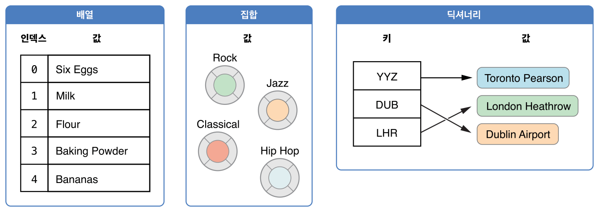

# 컬렉션형

{: .no_toc }

<details open markdown="block">
  <summary>
    목차
  </summary>
  {: .text-delta }
1. TOC
{:toc}
</details>

---

Swift는 **컬렉션형**을 사용하여 값들의 묶음, 즉 컬렉션을 저장합니다. 기초 컬렉션형으로는 배열, 집합, 딕셔너리가 있습니다. 배열은 값들이 순서대로 나열된 컬렉션입니다. 집합은 중복되지 않는 값들의 순서 없는 컬렉션입니다. 딕셔너리는 키-값 조합들로 이루어진 순서 없는 컬렉션입니다.



Swift의 배열, 집합, 딕셔너리는 저장할 수 있는 값과 키의 자료형이 언제나 명확합니다. 즉, 컬렉션에 잘못된 자료형의 값을 삽입할 일은 실수로라도 일어나지 않습니다. 반대로 컬렉션에서 찾을 값의 자료형도 헷갈리지 않고 확실히 알 수 있습니다.

> **참고**
> 
> Swift의 배열과 집합, 딕셔너리형은 **제네릭 컬렉션**으로 구현되어 있습니다. 제네릭형과 컬렉션에 대한 자세한 정보는 [제네릭](generics.md)를 참고하세요.

## 컬렉션의 변경

배열이나 집합, 딕셔너리를 변수로 생성하면, 그 생성된 컬렉션은 변경될 수 **있습니다.** 즉, 컬렉션이 생성된 후에도 값을 추가하거나, 제거하거나, 바꾸는 식으로 컬렉션을 **변경할** 수 있습니다. 배열, 집합, 딕셔너리를 상수로 생성하면 컬렉션을 변경할 수 **없습니다.** 컬렉션의 크기나 내용물은 바뀔 수 없습니다.

> **참고**
> 컬렉션이 바뀔 필요가 없다면 항상 변경 불가능한 컬렉션으로 생성하도록 하세요. 그렇게 하면 여러분도 코드를 파악하기 쉽고 Swift 컴파일러도 컬렉션의 성능을 최적화할 수 있습니다.

## 배열

**배열**은 같은 자료형의 값들을 정렬하여 목록으로 저장합니다. 배열 내에 다른 위치에서 같은 값이 여러 번 등장할 수도 있습니다.

> **참고**
> 
> Swift의 `Array`형은 Foundation의 `NSArray` 클래스와 연결됩니다.
> 
> `Array`를 Foundation과 Cocoa와 함께 사용하려면 [Array와 NSArray의 연결(영문)](https://developer.apple.com/documentation/swift/array#2846730)을 참고하세요.

### 배열형의 축약형 문법

Swift 배열의 자료형의 완전한 표기법은 `Array<Element>`입니다. (단, `Element`는 배열이 저장할 수 있는 값의 자료형) 그렇지만 배열형을 축약형인 `[Element]`으로 적어도 됩니다. 두 형식 모두 기능적으로는 동등하지만 축약형이 일반적으로 더 선호됩니다. 이 안내서에서도 축약형을 계속 사용합니다.

### 빈 배열 생성

이니셜라이저 문법을 사용하면 특정 자료형의 빈 배열을 생성할 수 있습니다.

```swift
var someInts: [Int] = []
print("someInts is of type [Int] with \(someInts.count) items.")
// "someInts is of type [Int] with 0 items." 출력
```

`someInts` 변수의 자료형은 이니셜라이저의 자료형으로부터 `[Int]`형으로 추론됩니다.

함수의 전달 인자나 이미 입력된 변수나 상수처럼 자료형에 관한 정보가 이미 주어진 상황이라면, 빈 배열 리터럴, 즉 `[]`(비어 있는 대괄호 쌍)을 적어 비어 있는 배열을 만들 수 있습니다.

```swift
someInts.append(3)
// someInts는 이제 Int형 값 하나를 가집니다.
someInts = []
// someInts는 이제 비어 있는 배열이지만, 자료형은 여전히 [Int]입니다.
```

### 기본 값을 가지는 배열 생성

Swift의 `Array`가 가진 이니셜라이저를 사용하면 모두 같은 기본 값을 가지는 정해진 크기의 배열을 만들 수 있습니다. 이니셜라이져에 알맞은 자료형의 기본 값(`repeating`)과 새 배열에서 그 값이 반복될 횟수(`count`)를 전달하세요.

```swift
var threeDoubles = Array(repeating: 0.0, count: 3)
// threeDoubles은 [Double]형이며, [0.0, 0.0, 0.0]과 같습니다.
```

### 두 배열을 더한 배열 생성

자료형이 같은 두 자료형을 덧셈 연산자(`+`)로 더하면 새로운 배열을 생성할 수 있습니다. 새 배열의 자료형은 더하는 두 배열의 자료형으로부터 추론됩니다.

```swift
var anotherThreeDoubles = Array(repeating: 2.5, count: 3)
// anotherThreeDoubles은 [Double]형이며, [2.5, 2.5, 2.5]와 같습니다.

var sixDoubles = threeDoubles + anotherThreeDoubles
// sixDoubles은 [Double]형이며, [0.0, 0.0, 0.0, 2.5, 2.5, 2.5]와 같습니다.
```

### 배열 리터럴을 이용한 배열 성성


wip...!!