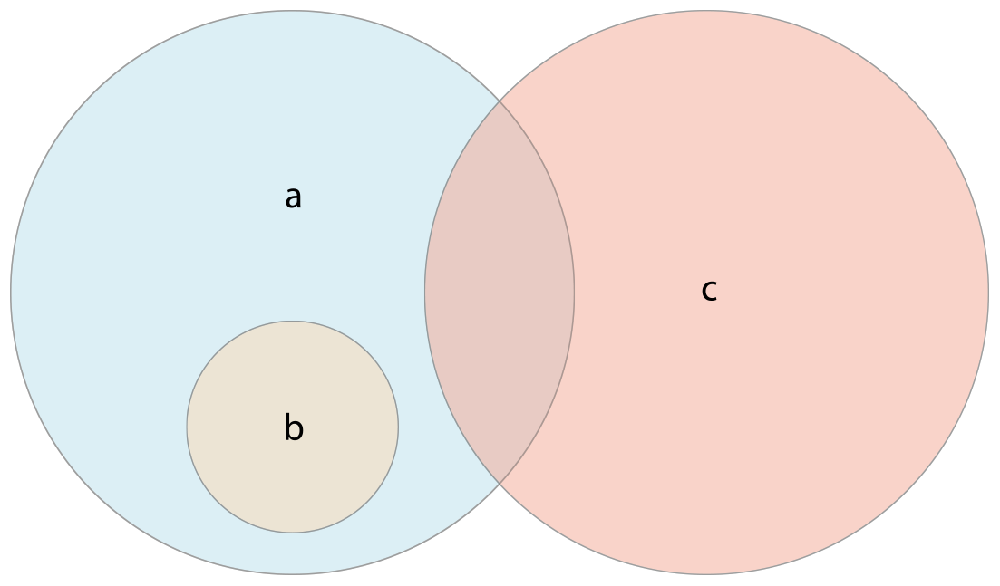

# 컬렉션형

{: .no_toc }

<details markdown="block">
  <summary>
    목차
  </summary>
  {: .text-delta }
1. TOC
{:toc}
</details>

---

Swift는 **컬렉션형**을 사용하여 값들의 묶음, 즉 컬렉션을 저장합니다. 기초 컬렉션형으로는 배열, 집합, 딕셔너리가 있습니다. 배열은 값들이 순서대로 나열된 컬렉션입니다. 집합은 중복되지 않는 값들의 순서 없는 컬렉션입니다. 딕셔너리는 키-값 조합들로 이루어진 순서 없는 컬렉션입니다.


Swift의 배열, 집합, 딕셔너리는 저장할 수 있는 값과 키의 자료형이 언제나 명확합니다. 즉, 컬렉션에 잘못된 자료형의 값을 삽입할 일은 실수로라도 일어나지 않습니다. 반대로 컬렉션에서 찾을 값의 자료형도 헷갈리지 않고 확실히 알 수 있습니다.

> **참고**
> 
> Swift의 배열과 집합, 딕셔너리형은 **제네릭 컬렉션**으로 구현되어 있습니다. 제네릭형과 컬렉션에 대한 자세한 정보는 [제네릭](generics.md)를 참고하세요.

## 컬렉션의 변경

배열이나 집합, 딕셔너리를 변수로 생성하면, 그 생성된 컬렉션은 변경될 수 **있습니다.** 즉, 컬렉션이 생성된 후에도 값을 추가하거나, 제거하거나, 바꾸는 식으로 컬렉션을 **변경할** 수 있습니다. 배열, 집합, 딕셔너리를 상수로 생성하면 컬렉션을 변경할 수 **없습니다.** 컬렉션의 크기나 내용물은 바뀔 수 없습니다.

> **참고**
> 컬렉션이 바뀔 필요가 없다면 항상 변경 불가능한 컬렉션으로 생성하도록 하세요. 그렇게 하면 여러분도 코드를 파악하기 쉽고 Swift 컴파일러도 컬렉션의 성능을 최적화할 수 있습니다.

## 배열

**배열**은 같은 자료형의 값들을 정렬하여 목록으로 저장합니다. 배열 내에 다른 위치에서 같은 값이 여러 번 등장할 수도 있습니다.

> **참고**
> 
> Swift의 `Array`형은 Foundation의 `NSArray` 클래스와 연결됩니다.
> 
> `Array`를 Foundation과 Cocoa와 함께 사용하려면 [Array와 NSArray의 연결(영문)](https://developer.apple.com/documentation/swift/array#2846730)을 참고하세요.

### 배열형 문법의 축약

Swift 배열의 자료형의 완전한 표기법은 `Array<Element>`입니다. (단, `Element`는 배열이 저장할 수 있는 값의 자료형) 그렇지만 배열형을 축약형인 `[Element]`으로 적어도 됩니다. 두 형식 모두 기능적으로는 동등하지만 축약형이 일반적으로 더 선호됩니다. 이 문서에서도 축약형을 계속 사용합니다.

### 빈 배열 생성

이니셜라이저 문법을 사용하면 특정 자료형의 빈 배열을 생성할 수 있습니다.

```swift
var someInts: [Int] = []
print("someInts is of type [Int] with \(someInts.count) items.")
// "someInts is of type [Int] with 0 items." 출력
```

`someInts` 변수의 자료형은 이니셜라이저의 자료형으로부터 `[Int]`형으로 추론됩니다.

함수의 전달 인자나 이미 입력된 변수나 상수처럼 자료형에 관한 정보가 이미 주어진 상황이라면, 빈 배열 리터럴, 즉 `[]`(비어 있는 대괄호 쌍)을 적어 비어 있는 배열을 만들 수 있습니다.

```swift
someInts.append(3)
// someInts는 이제 Int형 값 하나를 가집니다.
someInts = []
// someInts는 이제 비어 있는 배열이지만, 자료형은 여전히 [Int]입니다.
```

### 기본 값을 가지는 배열 생성

Swift의 `Array`가 가진 이니셜라이저를 사용하면 모두 같은 기본 값을 가지는 정해진 크기의 배열을 만들 수 있습니다. 이니셜라이져에 알맞은 자료형의 기본 값(`repeating`)과 새 배열에서 그 값이 반복될 횟수(`count`)를 전달하세요.

```swift
var threeDoubles = Array(repeating: 0.0, count: 3)
// threeDoubles은 [Double]형이며, [0.0, 0.0, 0.0]과 같습니다.
```

### 두 배열을 더한 배열 생성

자료형이 같은 두 자료형을 덧셈 연산자(`+`)로 더하면 새로운 배열을 생성할 수 있습니다. 새 배열의 자료형은 더하는 두 배열의 자료형으로부터 추론됩니다.

```swift
var anotherThreeDoubles = Array(repeating: 2.5, count: 3)
// anotherThreeDoubles은 [Double]형이며, [2.5, 2.5, 2.5]와 같습니다.

var sixDoubles = threeDoubles + anotherThreeDoubles
// sixDoubles은 [Double]형이며, [0.0, 0.0, 0.0, 2.5, 2.5, 2.5]와 같습니다.
```

### 배열 리터럴을 이용한 배열 성성

**배열 리터럴**을 이용해서 배열을 초기화할 수도 있습니다. 배열 리터럴은 하나 이상의 값들로 배열 컬렉션을 작성하는 축약형 방법입니다. 값들을 쉼표로 분리하여 적고 대괄호로 감싸 작성합니다.

```swift
[value 1, value 2, value 3]
```

아래 예시에서는 `String` 값들을 저장하는 배열 `shoppingList`를 만들고 있습니다.

```swift
var shoppingList: [String] = ["Eggs", "Milk"]
// shoppingList가 두 개의 초기 원소들로 초기화됩니다.
```

선언된 `shoppingList` 변수는 "문자열 값들의 배열"으로, `[String]`으로 표현합니다. 이 배열의 경우에는 `String` 값들로 지정되었기에 오직 `String` 값들만 저장할 수 있습니다. `shoppingList` 배열은 배열 리터럴을 이용하여 두 `String` 값(`"Eggs"`와 `"Milk"`)으로 초기화됩니다.

> **참고**
> 
> 아래 예시에서처럼 쇼핑 목록에는 물품들이 더 추가될 수 있습니다. 따라서 `shoppingList` 배열은 (`let`을 사용하는) 상수가 아닌 (`var`를 사용하는) 변수로 선언되었습니다.

이 경우 배열 리터럴은 오직 두 개의 `String` 값만 포함하고 있습니다. 이는 `shoppingList` 변수의 선언과 일치하며(배열은 `String` 값만 저장할 수 있다), 따라서 배열 리터럴을 이용해 `shoppingList`를 두 개의 초기 원소로 초기화하는 것이 가능합니다.

Swift의 자료형 추론 덕분에 하나의 자료형으로 이루어진 배열 리터럴로 배열을 초기화할 때, 자료형을 적지 않아도 됩니다. `shoppingList`의 초기화도 아래와 같이 더 짧게 가능합니다.

```swift
var shoppingList = ["Eggs", "Milk"]
```

배열 리터럴의 값들이 모두 같은 자료형이므로 Swift는 `shoppingList` 변수의 자료형으로 `[String]`이 알맞다고 추론할 수 있습니다.

### 배열에의 접근과 배열 수정

배열에 접근하거나 배열을 수정할 때는 메서드나 프로퍼티를 이용하거나 첨자 문법을 사용합니다.

배열이 가진 원소의 개수를 알아내기 위해서는 읽기 전용 프로퍼티인 `count`가 사용됩니다.

```swift
print("The shopping list contatins \(shoppingList.count) items.")
// "The shopping list contains 2 items." 출력
```

불형 프로퍼티인 `isEmpty`는 `count` 프로퍼티의 값이 `0`인지 검사하는 것과 같은 결과를 제시합니다.

```swift
if shoppingList.isEmpty {
    print("The shopping list is empty.")
} else {
    print("The shopping list isn't empty.")
}
// "The shopping list isn't empty." 출력
```

배열의 `append(_:)` 메서드를 호출하면 배열 끝에 새로운 원소를 추가할 수 있습니다.

```swift
shoppingList.append("Flour")
// 누군가 팬케이크를 만들려나 봅니다. shoppingList는 이제 3개의 원소를 가집니다.
```

덧셈 할당 연산자(`+=`)로도 배열에 원소를 추가할 수 있습니다.

```swift
shoppingList += ["Baking Powder"]
// shoppingList는 이제 4개의 원소를 가집니다.
shoppingList += ["Chocholate Spread", "Cheese", "Butter"]
// shoppingList는 이제 7개의 원소를 가집니다.
```

첨자 문법으로 배열이 가진 원소의 값을 얻어낼 수 있습니다. 얻고 싶은 값의 인덱스를 대괄호로 감싸 배열 이름 바로 뒤에 붙이세요.

```swift
var firstItem = shoppingList[0]
// firstItem은 "Eggs"와 같습니다.
```

> **참고**
> 
> 배열의 첫 번째 원소는 인덱스 값이 `1`이 아니라 `0`입니다. Swift에서 배열의 인덱스는 항상 `0`부터 시작합니다.

첨자 문법은 주어진 인덱스에 위치한 값을 바꾸는 데 사용할 수도 있습니다.

```swift
shoppingList[0] = "Six eggs"
// 목록의 첫 번째 아이템은 이제 "Eggs"가 아닌 "Six eggs"입니다.
```

첨자 문법을 사용할 때는 지정하는 인덱스가 항상 유효해야 합니다. 예를 들어, 배열의 끝에 원소를 추가하기 위해 `shoppingList[shoppingList.count] = "Salt"라고 적는다면 런타임 오류가 발생합니다.

첨자 문법으로 특정 범위의 값들을 한 번에 바꿀 수도 있습니다. 심지어 바꾸려는 범위와 바꾸는 값들의 길이가 달라도 가능합니다. 다음 예시에서는 `"Chocolate Spread"`, `"Cheese"`, `"Butter"`를 `"Bananas"`, `"Apples"`로 바꾸고 있습니다.

```swift
shoppingList[4...6] = ["Bananas", "Apples"]
// shoppingList는 이제 6개의 원소를 가집니다.
```

특정 인덱스에 원소를 삽입하려면 배열이 가진 `insert(_:at:)` 메서드를 호출하세요.

```swift
shoppingList.insert("Maple Syrup", at: 0)
// shoppingList는 이제 7개의 원소를 가집니다.
// "Maple Syrup"은 이제 목록의 첫 번쨰 원소가 됩니다.
```

`insert(_:at:)` 메서드가 `"Maple Syrup"`이라는 값을 가지는 새로운 원소를, 인덱스가 `0`으로 지정됨에 따라, 쇼핑 목록의 맨 처음에 삽입합니다.

배열에서 원소를 제거할 때는 `remove(at:)` 메서드를 사용하면 됩니다. 이 메서드는 특정 인덱스에 위치한 원소를 지우고 그 원소를 반환합니다: (물론, 필요 없다면 반환된 값은 무시할 수 있습니다.)

```swift
let mapleSyrup = shoppingList.remove(at: 0)
// 인덱스 0에 있던 원소가 제거됩니다.
// shoppingList는 이제 Maple Syrup이 빠져 6개의 원소를 가집니다.
// mapleSyrup 상수는 제거된 "Maple Syrup" 문자열과 같습니다.
```

> **참고**
> 
> 배열의 범위를 벗어나는 인덱스를 참조하려고 하면 런타임 오류가 발생합니다. 인덱스를 사용하기 전에 `count` 프로퍼티를 사용하여 그 인덱스가 유효한지 검사할 수 있습니다. 인덱스가 0부터 시작하므로 최대 유효 인덱스는 `count - 1`입니다. `count`가 `0`일 때는(즉, 배열이 비어 있다면) 유효한 인덱스가 없습니다.

원소가 제거되어도 배열은 내부에 공백이 없도록 유지되므로 인덱스 `0`에 위치한 값은 다시 `"Six eggs"`가 됩니다.

```swift
firstItem = shoppingList[0]
// firstItem은 이제 "Six eggs"와 같습니다.
```

배열의 마지막 원소를 제거하고 싶다면 `remove(at:)` 메서드를 사용하여 `count` 프로퍼티를 요청하지 말고, `removeLast()` 메서드를 사용하세요. `remove(at:)` 메서드와 마찬가지로 `removeLast()` 또한 제거된 원소를 반환합니다.

```swift
let apples = shoppingList.removeLast()
// 배열의 마지막 원소가 제거됩니다.
// shoppingList는 이제 apples가 빠져 5개의 원소를 가집니다.
// apples 상수는 제거된 "Apples" 문자열과 같습니다.
```

### 배열 반복

`for`-`in` 반복문으로 배열의 모든 값들을 반복할 수 있습니다.

```swift
for item in shoppingList {
    print(item)
}
// Six eggs
// Mik
// Flour
// Baking Powder
// Bananas
```

원소 각각의 값뿐만 아니라 정수 인덱스까지 필요하다면 반복할 때 `enumerated()` 메서드를 사용하세요. 각각의 원소에 대해 `enumerated()` 메서드는 정수와 원소의 값으로 이루어진 튜플을 반환합니다. 정수는 `0`부터 시작하여 원소마다 하나씩 증가합니다. 배열 전체를 반복한다면, 이 정수들은 원소의 인덱스들과 같게 됩니다. 튜플을 임시 상수나 변수로 분해할 수도 있습니다.

```swift
for (index, value) in shoppingList.enumerated() {
    print("Item \(index + 1): \(value)")
}
// Item 1: Six eggs
// Item 2: Milk
// Item 3: Flour
// Item 4: Baking Powder
// Item 5: Bananas
```

`for`-`in` 반복문에 대해서는 [For-In 반복문](control-flow.md#For-In-반복문)을 참고하세요.

## 집합

**집합**은 같은 자료형의 서로 다른 값들을 정해진 순서 없이 컬렉션에 저장합니다. 원소들의 순서가 중요하지 않거나 원소들이 오직 한 번씩만 등장하는 상황이라면 배열 대신 집합을 사용할 수 있습니다.

> **참고**
> 
> Swift의 `Set` 자료형은 Foundation의 `NSSet` 클래스와 연결됩니다.
> 
> Foundation이나 Cocoa와 함께 `Set`을 사용하는 것에 관한 자세한 정보는 [`Set`과 `NSSet`의 연결(영문)](https://developer.apple.com/documentation/swift/set#2845530)을 참고하세요.

### 집합형의 해시 값

값들을 집합에 저장하기 위해서는 해싱이 가능해야 합니다. 즉, 값들의 자료형마다 해시 값을 계산하는 방법이 있어야 합니다. 해시 값은 동등한 모든 객체에 대해 동일한 `Int` 값을 말합니다. `a == b`라면 `a`와 `b`는 같은 해시 값을 가져야 합니다.

Swift의 모든 기초 자료형(`String`, `Int`, `Double`, `Bool` 등)은 기본적으로 해싱이 가능합니다. 이들이 집합의 값이나 딕셔너리의 키에 사용될 수 있습니다. 연관 값이 없는 열거형 값([열거형](enumerations.md)에성 설명)들도 기본으로 해싱이 가능합니다.

> **참고**
> 
> 직접 정의한 자료형도 집합의 값이나 딕셔너리의 키의 자료형으로 사용할 수 있습니다. 자료형이 Swift의 표준 라이브러리에서 정하는 `Hashable` 프로토콜을 따르도록 하세요. `hash(into:)` 메서드를 구현하는 자세한 방법은 [해시 가능(영문)](https://developer.apple.com/documentation/swift/hashable)을 참고하세요. 프로토콜을 따르도록 하는 방법은 [프로토콜](protocols.md)을 참고하세요.

### 집합형 문법

Swift 집합의 자료형은 집합이 저장할 수 있는 자료형을 `Element`라고 했을 때, `Set<Element>`이라고 표기합니다. 배열과 다르게 집합은 이에 대한 축약형이 없습니다.

### 빈 집합 생성 및 초기화

이니셜라이저 문법으로 특정 자료형의 비어 있는 집합을 생성할 수 있습니다.

```swift
var letters = Set<Character>()
print("letters is of type Set<Character> with \(letters.count) items.")
// "letters is of type Set<Character> with 0 items." 출력
```

> **참고**
> 
> 이니셜라이저의 자료형으로부터 `letters` 변수의 자료형이 `Set<Character>`으로 추론됩니다.

함수의 인자나 이전에 명시된 자료형 등으로 인해 이미 자료형에 대한 정보가 알려져 있다면, 빈 배열 리터럴로 비어 있는 집합을 만들 수도 있습니다.

```swift
letters.insert("a")
// letters는 이제 Character형의 값 하나를 가집니다.
letters = []
// letters는 이제 빈 집합이지만, 자료형은 여전히 Set<Character>입니다.
```

### 배열 리터럴로 집합 생성

배열 리터럴을 축약형으로 이용하여 하나 이상의 값들을 가진 집합을 초기화할 수 있습니다.

아래 예시는 `String` 값들을 저장하는 집합 `favoriteGenres`를 생성하는 코드를 보여줍니다.

```swift
var favoriteGenres: Set<String> = ["Rock", "Classical", "Hip hop"]
// favoriteGenres는 세 개의 초기 원소를 가진 채 초기화됩니다.
```

`favoriteGenres` 변수는 "`String` 값들의 집합", 즉 `Set<String>`으로 선언됩니다. 여기서 값의 자료형이 `String`으로 특정되었으므로 집합은 `String` 값**만** 저장할 수 있습니다. `favoriteGenres` 집합은 배열 리터럴에 적힌 세 `String` 값(`"Rock"`, `"Classical"`, `"Hip hop"`)으로 초기화됩니다.

> **참고**
> 
> `favoriteGenres`는 아래 예시에서 가지고 있는 원소가 늘어나거나 줄어들기 때문에 (`let`을 사용한) 상수가 아닌 (`var`를 사용한) 변수로 선언되었습니다.

변수 리터럴만으로는 집합형이라는 사실을 추론할 수 없으므로 `Set`이 명시적으로 선언되어야 합니다. 그러나 Swift의 자료형 추론 덕분에, 하나의 자료형만으로 이루어진 배열 리터럴로 집합을 초기화한다면 원소의 자료형은 표기하지 않아도 됩니다. `favoriteGenres`의 초기화도 더 짧게 줄일 수 있습니다.

```swift
var favoriteGenres: Set = ["Rock", "Classical", "Hip hop"]
```

배열 리터럴의 값들이 모두 동일한 자료형이므로 Swift는 `Set<String>`이 `favoriteGenres` 변수의 알맞은 자료형이라고 추론합니다.

### 집합에의 접근과 수정

집합이 가진 메서드와 프로퍼티로 집합에 접근하고 집합을 수정할 수 있습니다.

집합이 가진 원소의 개수를 알아내기 위해서는 읽기 전용 프로퍼티인 `count`를 사용하세요.

```swift
print("I have \(favoriteGenres.count) favorite music genres.")
// "I have 3 favorite music genres." 출력
```

불형 프로퍼티인 `isEmpty`는 `count` 프로퍼티의 값이 `0`인지 검사하는 것과 같은 결과를 제시합니다.

```swift
if favoriteGenres.isEmpty {
    print("As far as music goes, I'm not pinky.")
} else {
    print("I have particular music preferences.")
}
// "I have particular music preferences." 출력
```

`insert(_:)` 메서드를 호출하여 집합에 새로운 원소를 추가할 수 있습니다.

```swift
favoriteGenres.insert("Jazz")
// favoriteGenres는 이제 4개의 원소를 가집니다.
```

`remove(_:)` 메서드는 집합에서 원소를 제거하는 역할을 합니다. 제거하려는 원소가 집합에 있다면 제거 후 그 값을 반환하며, 집합에 없는 원소를 제거하려 한다면 `nil`을 반환합니다. `removeAll()` 메서드는 집합의 모든 원소를 제거합니다.

```swift
if let removedGenre = favoriteGenres.remove("Rock") {
    print("\(removedGenre)? I'm over it.")
} else {
    print("I never much cared for that.")
}
// "Rock? I'm over it." 출력
```

집합이 특정 원소를 포함하고 있는지 검사하려면 `contains(_:)` 메서드를 사용하세요.

```swift
if favoriteGenres.contains("Funk") {
    print("I get up on the good foot.")
} else {
    print("It's too funcky in here.")
}
// "It's too funky in here." 출력
```

### 집합 반복

`for`-`in` 반복문으로 집합이 가진 원소들을 반복할 수 있습니다.

```swift
for genre in favoriteGenres {
    print("\(genre)")
}
// Classical
// Jazz
// Hiphop
```

`for`-`in` 반복문에 대해서는 [For-In 반복문](control-flow.md#For-In-반복문)을 참고하세요.

Swift의 `Set`형에는 정해진 순서가 없습니다. 집합의 원소들을 특정한 순서로 반복하려면 `sorted()` 메서드를 사용하세요. `sorted()` 메서드는 집합의 원소들을 `<` 연산자에 따라 정렬한 배열을 반환합니다.

```swift
for genre in favoriteGenres.sorted() {
    print("\(genre)")
}
// Classical
// Hip hop
// Jazz
```

## 집합 연산

기초적인 집합 연산에는 두 집합을 합치거나, 두 집합이 공통으로 가지는 원소를 구분하거나, 두 집합의 원소가 전부 동일한지, 일부만 동일한지, 하나도 같지 않은지 등을 판단하는 연산들이 있습니다.

### 집합 연산 기초

아래 그림은 두 집합 `a`와 `b` 에 대한 여러 집합 연산들의 결과를 어두운 영역으로써 나타내고 있습니다.


* `intersection(_:)` 메서드는 두 집합에 모두 포함된 원소들로만 이루어진 새로운 집합을 만듭니다.
* `symmetricDifference(_:)` 메서드는 두 집합 중 정확히 한 집합에만 포함된 원소들로 이루어진 새로운 집합을 만듭니다.
* `union(_:)` 메서드는 두 집합에 포함된 원소들을 모두 포함하는 새로운 집합을 만듭니다.
* `subtracting(_:)` 메서드는 전달된 집합에는 없는 원소들로만 이루어진 새로운 집합을 만듭니다.

```swift
let oddDigits: Set = [1, 3, 5, 7, 9]
let evenDigits: Set = [0, 2, 4, 6, 8]
let singleDigitPrimeNumbers: Set = [2, 3, 5, 7]

oddDigits.union(evenDigits).sorted()
// [0, 1, 2, 3, 4, 5, 6, 7, 8, 9]
oddDigits.intersection(evenDigits).sorted()
// []
oddDigits.subtracting(singleDigitPrimeNumbers).sorted()
// [1, 9]
oddDigits.symmetricDifference(singleDigitPrimeNumbers).sorted()
// [1, 2, 9]
```

### 집합의 포함 관계와 동등성

아래 그림은 세 집합 `a`, `b`, `c`이 서로 원소를 공유하며 생기는 겹친 영역을 보여줍니다. 집합 `a`가 집합 `b`의 모든 원소를 포함하므로 `a`는 `b`의 **초집합**이라고 합니다. 반대로 집합 `b`의 모든 원소가 집합 `a`에 포함되어 있으므로 `b`는 `a`의 **부분집합**이라고 합니다. 집합 `b`와 집합 `c`는 공통으로 가지는 원소가 없으므로 **서로소**라고 합니다.



* 동등 연산자(`==`)는 두 집합이 모두 같은 원소를 가지고 있는지 판단합니다.
* `isSubset(of:)` 메서드는 집합의 모든 원소가 전달된 집합에 포함되는지 판단합니다.
* `isSuperset(of:)` 메서드는 집합이 전달된 집합의 모든 원소를 포함하는지 판단합니다.
* `isStrictSubset(of:)`과 `isStrictSuperset(of:)` 메서드는 각각 집합이 전달된 집합과 같지 않으면서 부분집합인지, 초집합인지 판단합니다.
* `isDisjoint(with:)` 메서드는 두 집합이 공통으로 가지는 원소가 없는지 판단합니다.

```swift
let houseAnimals: Set = ["🐶", "🐱"]
let farmAnimals: Set = ["🐮", "🐔", "🐑", "🐶", "🐱"]
let cityAnimals: Set = ["🐦", "🐭"]

houseAnimals.isSubset(of: farmAnimals)
// true
farmAnimals.isSuperset(of: houseAnimals)
// true
farmAnimals.isDisjoint(with: cityAnimals)
// true
```

## 딕셔너리

**딕셔너리**는 정해진 자료형의 키와 정해진 자료형의 값들의 조합을 정해진 순서 없이 컬렉션으로 저장합니다. 각각의 값들은 고유의 **키**와 연관됩니다. 여기서 키는 딕셔너리에서 그 값에 대응하는 식별자로서 역할합니다. 배열의 원소들과 다르게 딕셔너리의 원소들에는 정해진 순서가 없습니다. 식별자를 따라 값을 찾아야 할 때 딕셔너리를 사용합니다. 실제 세계에서 사전이 특정 단어의 정의를 찾는 데 쓰이는 것과 비슷합니다.

> Swift의 `Dictionary`형은 Foundation의 `NSDictionary` 클래스와 연결됩니다.
> 
> `Dictionary`를 Foundation과 Cocoa와 함께 사용하려면 [Dictionary와 NSDictionary의 연결(영문)](https://developer.apple.com/documentation/swift/dictionary#2846239)을 참고하세요.

### 딕셔너리형 문법의 축약

Swift의 딕셔너리형은 `Key`가 저장하려는 키의 자료형, `Value`가 저장하려는 값의 자료형이라고 할 때, `Dictionary<Key, Value>`라고 적을 수 있습니다.

> **참고**
> 
> 집합에서 값들의 자료형과 마찬가지로 `Key`형은 반드시 `Hashable` 프로토콜을 준수해야 합니다.

딕셔너리의 자료형은 단축형으로서 `[Key: Value]`로 적을 수도 있습니다. 두 형태가 기능적으로는 동일하지만 일반적으로 축약형이 더 선호되며, 여기서도 딕셔너리의 형을 이야기할 때 축약형을 사용합니다. 

### 빈 딕셔너리 생성

배열과 마찬가지로 이니셜라이저 문법을 사용하면 특정 자료형의 비어 있는 `Dictionary`를 만들 수 있습니다.

```swift
var namesOfIntegers: [Int: String] = [:]
// namesOfIntegers는 이제 비어 있는 [Int: String] 딕셔너리입니다.
```

이 예시에서는 정수 값에 사람이 읽을 수 있는 이름을 붙이기 위해 `[Int: String]`형의 빈 딕셔너리를 만들고 있습니다. 키는 `Int`형이고 값은 `String`형입니다.

이미 자료형에 대한 정보가 주어져 있다면, 빈 배열 리터럴 `[:]`(콜론을 대괄호로 감싼 형태)로 비어 있는 배열을 만들 수 있습니다.

```swift
namesOfIntegers[16] = "sixteen"
// namesOfIntegers는 이제 1개의 키-값 쌍을 가집니다.
namesOfIntegers = [:]
// namesOfIntgers는 다시 비어 있는 [Int: String]이 됩니다.
```

### 딕셔너리 리터럴로 딕셔너리 생성

딕셔너리는 앞서 본 배열 리터럴과 비슷한 문법을 가진 **딕셔너리 리터럴**로 초기화할 수 있습니다. 딕셔너리 리터럴은 하나 이상의 키-값 쌍을 `Dictionary` 컬렉션으로 만드는 축약형 문법입니다.

**키-값 쌍**은 키 하나와 값 하나의 조합입니다. 딕셔너리 리터럴에서 각각의 키-값 쌍의 키와 값은 콜론으로 구분됩니다. 키-값 쌍들은 배열처럼 쉼표로 구분하고 전체를 대괄호로 감쌉니다.

```swift
[key 1: value 1, key 2: value 2, key 3: value 3]
```

아래 예시는 국제 공항들의 이름을 저장하는 딕셔너리를 만들고 있습니다. 여기서 키는 세 글자로 된 IATA(국제항공운송협회) 코드이고, 값은 공항의 이름이 됩니다.

```swift
var airports: [String: String] = ["YYZ": "Toronto Pearson", "DUB": "Dublin"]
```

`airports` 딕셔너리는 `[String: String]` 형으로 선언됩니다. 키도 `String`형, 값도 `String`형인 `Dictionary`라는 뜻입니다.

> **참고**
> 
> 아래 예시에서 공항이 더 추가될 수 있으므로 `airports` 딕셔너리는 (`let`을 사용한) 상수가 아닌 (`var`를 사용한) 변수로 선언됩니다.

`airports` 딕셔너리는 두 개의 키-값 쌍을 가진 딕셔너리 리터럴로 초기화됩니다. 첫 번째 쌍은 키가 `"YYZ"`, 값이 `"Toronto Pearson"`이고, 두 번째 쌍은 키가 `"DUB"`, 값이 `"Dublin"`입니다.

이 딕셔너리 리터럴은 두 `String: String` 쌍을 가지고 있습니다. 이 키-값 형은 (`String` 키와 `String` 값만 저장할 수 있는) `airports` 변수 선언에 부합합니다. 따라서 이 딕셔너리 리터럴로 `airports` 딕셔너리를 두 원소로 초기화하는 것이 가능합니다.

배열에서와 마찬가지로, 딕셔너리 리터럴의 키와 값들이 각각 하나의 자료형으로 이루어져 있다면 이 리터럴로 딕셔너리를 초기화할 때 자료형을 명시하지 않아도 됩니다. `airports`의 초기화는 다음처럼 더 짧아질 수 있습니다.

```swift
var airports = ["YYZ": "Toronto Pearson", "DUB": "Dublin"]
```

리터럴의 모든 키가 자료형이 서로 같으며, 모든 값들도 자료형이 서로 같으므로 Swift는 `[String: String]`이 `airports` 딕셔너리의 자료형으로 적절하다고 추론합니다.

### 딕셔너리에의 접근과 수정

딕셔너리가 가진 메서드나 프로퍼티, 첨자 문법으로 딕셔너리에 접근하고 딕셔너리를 수정할 수 있습니다.

배열에서처럼 `Dictionary`의 읽기 전용 프로퍼티인 `count`를 검사하면 딕셔너리가 가진 원소의 수를 알아낼 수 있습니다.

```swift
print("The airports dictionary contains \(airports.count) items.")
// "The airports dictionary contains 2 items." 출력
```

불형 프로퍼티인 `isEmpty`는 `count` 프로퍼티의 값이 `0`인지 검사하는 것과 같은 결과를 제시합니다.

```swift
if airports.isEmpty {
    print("The airports dictionary is empty.")
} else {
    print("The airports dictionary isn't empty.")
}
// "The airports dictionary isn't empty." 출력
```

첨자 문법으로 딕셔너리에 새 원소를 추가할 수 있습니다. 적절한 자료형의 새로운 키를 첨자 인덱스로 사용하고 적절한 자료형의 새로운 값을 할당하세요.

```swift
airports["LHR"] = "London"
// airports 딕셔너리는 이제 3개의 원소를 가집니다.
```

특정 키에 연관된 값을 바꾸는 데 첨자 문법을 사용할 수도 있습니다.

```swift
airports["LHR"] = "London Heathrow"
// "LHR"에 대한 값이 "London Heathrow"으로 바뀝니다.
```

첨자 말고도 딕셔너리의 `updateValue(_:forKey:)` 메서드로도 특정 키에 대한 값을 설정하거나 업데이트할 수 있습니다. 첨자 예시에서와 마찬가지로, `updateValue(_:forKey:)` 메서드도 키가 존재하지 않으면 키에 대한 값을 설정하고, 키가 이미 존재하면 값을 업데이트합니다. 그러나 첨자와 다르게 `updateValue(_:forKey:)` 메서드는 업데이트 이후에 **기존** 값을 반환합니다. 이로써 업데이트가 일어났는지 여부를 검사할 수 있습니다.

`updateValue(_:forKey:)` 메서드는 딕셔너리의 값의 자료형에 대한 옵셔널 값을 반환합니다. 예를 들어, `String` 값을 저장하는 딕셔너리에서 이 메서드는 `String?` 즉, "옵셔널 `String`" 값을 반환합니다. 이 옵셔널 값은 업데이트 전에 키가 존재했다면 그 키에 대한 기존 값을 감싸고, 키가 존재하지 않았다면 `nil`을 반환합니다.

```swift
if let oldValue = ariports.updateValue("Dublin Airport", forKey: "DUB") {
    print("The old value for DUB was \(oldValue).")
}
// "The old value for DUB was Dublin." 출력
```

특정 키에 대한 값을 얻는 데에도 첨자 문법을 사용할 수 있습니다. 값이 없는 키를 요청할 수도 있으므로 딕셔너리의 첨자는 딕셔너리의 값의 자료형에 대한 옵셔널 값을 반환합니다. 만약 딕셔너리가 요청한 키에 대한 값을 가진다면 그 키에 대한 값을 감싸는 옵셔널 값을 반환합니다. 그렇지 않다면 첨자는 `nil`을 반환합니다.

```swift
if let airportName = airports["DUB"] {
    print("The name of the airport is \(airportName).")
} else {
    print("That airport isn't in the airports dictionary.")
}
// "The name of the airport is DUblin Airport." 출력
```

첨자 문법을 사용해서 특정 키에 `nil` 값을 할당하면 그 키-값 쌍은 딕셔너리에서 지워집니다.

```swift
airports["APL"] = "Apple Internaional"
// "Apple International"은 APL의 실제 공항이 아니므로 지우도록 합니다.
airports["APL"] = nil
// APL은 이제 딕셔너리에서 지워집니다.
```

`removeValue(forKey:)` 메서드로도 딕셔너리에서 키-값 쌍을 지울 수 있습니다. 이 메서드는 만약 해당 쌍이 존재한다면 쌍을 지운 후 그 값을 반환하고, 존재하지 않는다면 `nil`을 반환합니다.

```swift
if let removedValue = airports.removeValue(forKey: "DUB") {
    print("The removed airport's name is \(removedValue).")
} else {
    print("The airports dictionary doesn't contain a value for DUB.")
}
// "The removed airport's name is Dublin Airport." 출력
```

### 딕셔너리 반복

`for`-`in` 반복문으로 딕셔너리의 키-값 쌍을 반복할 수 있습니다. 딕셔너리의 각각의 원소는 `(key, value)` 튜플로 반환되므로 이 튜플의 원소들을 임시 상수나 변수로 분해하면 됩니다.

```swift
for (airportCode, airportName) in airports {
    print("\(airportCode): \(airportName)")
}
// LHR: London Heathrow
// YYZ: Toronto Pearson
```

`for`-`in` 반복문에 대해서는 [For-In 반복문](control-flow.md#For-In-반복문)을 참고하세요.

딕셔너리의 `keys`, `values` 프로퍼티에 접근하면 딕셔너리의 키나 값으로 이루어진 반복 가능한 컬렉션을 얻을 수 있습니다.

```swift
for airportCode in airports.keys {
    print("Airport code: \(airportCode)")
}
// Airport code: LHR
// Airport code: YYZ

for airportName in airports.values {
    print("Airport name: \(airportName)")
}
// Airport name: London Heathrow
// Airport name: Toronto Pearson
```

`Array` 인스턴스를 받는 API에서 딕셔너리의 키나 값들을 사용해야 한다면, `keys`나 `values` 프로퍼티로 새로운 배열을 초기화하세요.

```swift
let airportCodes = [String](airports.keys)
// airportCode은 ["LHR", "YYZ"]입니다.

let airportNames = [String](airports.values)
// airportNames는 ["London Heathrow", "Toronto Pearson"]입니다.
```

Swift의 `Dictionary`형에는 정해진 순서가 없습니다. 키나 값을 특정한 순서로 반복하려면 `keys`나 `values` 프로퍼티에 대해 `sorted()` 메서드를 사용하세요.