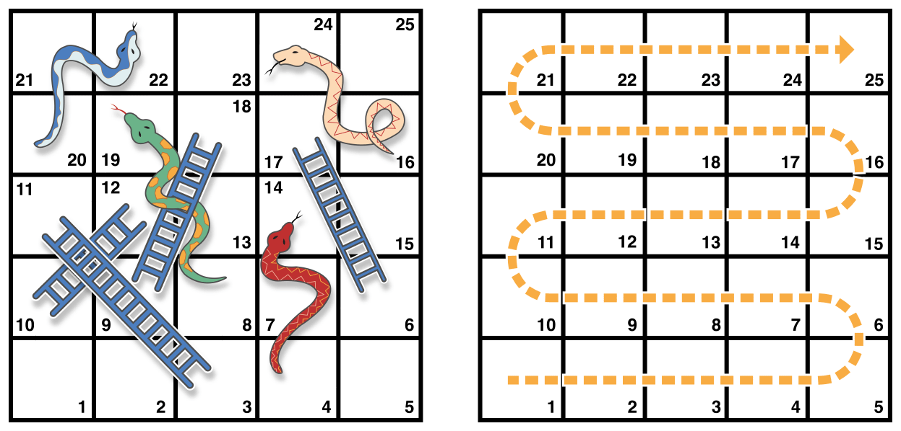

# 컬렉션형

{: .no_toc }

<details markdown="block">
  <summary>
    목차
  </summary>
  {: .text-delta }
1. TOC
{:toc}
</details>

---

Swift는 다양한 제어 흐름 구문을 제공합니다. 작업을 여러 번 반복하도록 하는 `while` 반복문, 상황에 따라 다른 분기를 실행하는 `if`, `guard`, `switch` 구문, 실행 흐름을 코드 내의 다른 부분으로 옮기는 `brack`와 `continue` 구문 등이 있습니다.

Swift는 배열, 딕셔너리, 범위, 문자열 등을 쉽게 반복할 수 있도록 `for`-`in` 반복문도 제공합니다.

Swift의 `switch` 구문은 C와 유사한 다른 언어들에서 사용되는 것보다 훨씬 강력합니다. 케이스는 간격 일치, 튜플, 특정 자료형으로의 캐스팅을 포함한 여러 패턴 매칭을 지원합니다. `switch` 케이스에서 매칭된 값은 임시 상수나 변수로서 케이스 몸체 내부에서 사용될 수 있습니다. 각각의 케이스마다 복잡한 매칭 조건도 `where` 절로 표현할 수 있습니다.

## For-In 반복문

`for`-`in` 반복문은 배열, 수의 범위, 문자열 내의 문자와 같은 순열을 반복하는 데 사용됩니다.

아래 예시는 배열의 원소들을 `for`-`in` 반복문을 이용하여 반복하고 있는 상황을 보여줍니다.

```swift
let names = ["Anna", "Alex", "Brian", "Jack"]
for name in names {
    print("Hello, \(name)!")
}
// Hello, Anna!
// Hello, Alex!
// Hello, Brian!
// Hello, Jack!
```

딕셔너리의 키-값 쌍도 반복할 수 있습니다. 딕셔너리의 각각의 원소는 반복될 때 `(key, value)` 튜플로 반환되며, 이를 이름을 가진 상수로 분해하여 `for`-`in` 반복문 몸체에서 사용할 수 있습니다. 아래 예시 코드에서 딕셔너리의 키들은 `animalName`이라는 이름의 상수로, 값들은 `legCount`라는 이름의 상수로 분해됩니다.

```swift
let numberOfLegs = ["spider": 8, "ant": 6, "cat": 4]
for (animalName, legCount) in numberOfLegs {
    print("\(animalName)s have \(legCount) legs")
}
// cats have 4 legs
// ants have 6 legs
// spiders have 8 legs
```

`Dictionary`의 내용은 애초에 순서가 없기 때문에 반복할 때 어느 원소부터 참조될지 보장하지 않습니다. `Dictionary`에 원소를 삽입한 순서도 반복되는 순서를 정하는 것이 아닙니다. 배열과 딕셔너리에 관한 자세한 설명은 [컬렉션형](collection-types.md)을 참고하세요.

`for`-`in` 반복문을 수의 범위와 함께 사용할 수도 있습니다. 아래 예시는 구구단 5단의 처음 몇 단계를 출력합니다.

```swift
for index in 1...5 {
    print("\(index) times 5 is \(index * 5)")
}
// 1 times 5 is 5
// 2 times 5 is 10
// 3 times 5 is 15
// 4 times 5 is 20
// 5 tiems 5 is 25
```

여기서 반복되는 순열은 양끝을 포함하여 `1`부터 `5`까지의 수로, 닫힌 범위 연산자(`...`)로 표현합니다. `index`의 값이 범위의 처음에 해당하는 `1`로 설정된 상태로 반복문 내부의 문장이 실행됩니다. 지금은 반복문 안에는 `index`의 현재 값에 대한 5단을 출력하는 문장 하나뿐입니다. 이 문장이 실행되고 나면 `index`의 값은 범위의 두 번째 값에 해당하는 `2`로 업데이트되고 `print(_:separator:terminator:)` 함수가 다시 호출됩니다. 이 과정이 범위의 끝에 도달할 때까지 계속됩니다.

위의 예시에서 `index`는 반복할 때마다 처음에 자동으로 설정되는 상수입니다. 따라서 `index`는 사용하기 전에 미리 선언할 필요가 없습니다. 반복문의 정의에 포함만 하면 `let` 선언 키워드 없이 묵시적으로 선언됩니다.

순열의 각각의 값이 필요 없다면 변수 이름 대신 밑줄을 입력해 값을 무시하세요.

```swift
let base = 3
let power = 10
var answer = 1
for _ in 1...power {
    answer *= base
}
print("\(base) to the power of \(power) is \(answer)")
// "3 to the power of 10 is 59049" 출력
```

이 예시는 어떤 수의 거듭제곱(지금은 `3`의 `10`제곱)을 계산합니다. `1`부터 `10`까지의 닫힌 범위에 따라 (`3`의 `0`제곱인) `1`에서 시작하여 `3`을 열 번 곱합니다. 이 계산에서는 각각의 반복이 몇 번째인지 셀 필요가 없습니다. 단순히 주어진 횟수만큼 반복을 실행합니다. 반복 변수 자리에 밑줄 문자(`_`)를 입력하면 각각의 값이 무시되어 매 반복에서 현재 값에 대한 접근이 불가능해집니다.

어떤 상황에서는 범위의 양끝을 포함하는 닫힌 범위가 부적절하기도 합니다. 시계 위에 매 분마다 눈금을 그린다고 생각해보세요. 눈금은 `0`분에서부터 시작해 총 `60`개가 필요합니다. 반 열린 범위 연산자(`..<`)를 사용하면 시작 값은 포함하지만 마지막 값은 포함하지 않는 범위가 만들어집니다. 범위에 관해서는 [범위 연산자](basic-operators.md/범위-연산자)를 참고하세요.

```swift
let minutes = 60
for tickMark in 0..<minutes {
    // 매 분마다 눈금 렌더 (60회)
}
```

사용자에 따라 UI에 눈금이 더 적어야 한다고 생각할 수도 있습니다. `5`분마다 눈금 하나를 그리기로 해봅시다. `stride(from:to:by)` 함수를 사용해 필요 없는 눈금을 건너뛰세요.

```swift
let minuteInterval = 5
for tickMark in stride(from: 0, to: minutes, by: minuteInterval) {
    // 5분마다 눈금 렌더 (0, 5, 10, 15 ... 45, 50, 55)
}
```

닫힌 범위도 `stride(from:through:by:)` 함수를 사용하면 됩니다.

```swift
let hours = 12
let hourInterval = 3
for tickMark in stride(from: 3, through: hours, by: hourInterval) {
    // 3시간마다 눈금 렌더 (3, 6, 9, 12)
}
```

지금까지 범위와 배열, 딕셔너리, 문자열을 반복하는 데 `for`-`in` 반복문을 사용했습니다. 그러나 [`Sequence`(영문)](https://developer.apple.com/documentation/swift/sequence) 프로토콜을 따르는 컬렉션이라면, 직접 정의한 클래스나 컬렉션형이든 **무엇이든** 반복하는 데 이 문법을 사용할 수 있습니다.

## While 반복문

`while` 반복문은 조건이 `false`가 될 때까지 내부 문장들을 수행합니다. 이런 형태의 반복문은 반복 횟수를 모른 채 반복을 시작해야 할 때 주로 사용됩니다. Swift는 두 가지 `while` 반복문을 지원합니다.

* `while`은 매 반복에 앞서 조건을 평가합니다.
* `repeat`-`while`은 매 반복이 끝나고 조건을 평가합니다.

### While

`while` 반복문은 하나의 조건문을 평가하는 것으로 시작합니다. 조건이 `true`라면 `false`가 될 때까지 내부의 문장들을 반복합니다.

`while` 반복문의 일반적인 형태는 이렇습니다.

```swift
while condition {
    statements
}
```

아래에 간단한 뱀 사다리 게임이 나와 있습니다. 



게임의 규칙은 다음과 같습니다:

* 보드 판에는 25개의 칸이 있으며, 게임의 목표는 25번 칸에 도달하거나 이를 넘어가는 것입니다.
* 플레이어는 보드 판의 왼쪽 아래 코너인 "0번 칸"에서 시작합니다.
* 매 턴마다 주사위를 굴려 나온 수만큼 위에 표시된 점선을 따라 이동합니다.
* 사다리 아래 끝에서 멈추면 사다리를 타고 올라갑니다.
* 뱀의 머리에서 멈추면 뱀을 타고 미끄러져 내려옵니다.

보드 판은 `Int` 값의 배열로 표현됩니다. 배열의 크기는 `finalSquare`라는 상수에 따릅니다. `finalSquare` 상수는 배열을 초기화하고 추후에 승리 조건을 검사하는 데 사용됩니다. 플레이어는 보드 판 바로 밖에 있는 "0번 칸"에서 시작하므로 보드 판은 26개의 `Int` 값 `0`으로 초기화됩니다.

```swift
let finalSquare = 25
var board = [Int](repeating: 0, count: finalSquare + 1)
```

뱀과 사다리를 고려하여 일부 칸들은 특별한 값들을 가지도록 설정합니다. 사다리 아래 끝에 해당하는 칸은 플레이어가 위로 올라가도록 양수 값을 가지고, 뱀 머리에 해당하는 칸은 플레이어가 아래로 내려가도록 음수 값을 가집니다.

```swift
board[03] = +08; board[06] = +11; board[09] = +09; board[10] = +02
board[14] = -10; board[19] = -11; board[22] = -02; board[24] = -08
```

3번 칸은 사다리 아래 끝으로서, 플레이어를 11번 칸으로 올립니다. 이걸 나타내고자 `board[03]`에 (`3`과 `11`의 차이인) 정수 값 `8`과 같은 의미의 `+08`을 할당합니다. 값과 문장들을 정렬하기 위해 단항 마이너스 연산자(`-i`)와 함꼐 단항 플러스 연산자(`+i`)도 명시적으로 사용했으며, `10`보다 작은 수들도 `0`을 사용하여 두 자리로 맞추었습니다. (스타일링에 관한 기술은 꼭 필요한 것은 아니지만 코드를 더 깔끔하게 만듭니다.)

```swift
var square = 0
var diceRoll = 0
while square < finalSquare {
    // 주사위 굴리기
    diceRoll += 1
    if diceRoll == 7 { diceRoll = 1}
    // 나온 눈의 수만큼 이동
    square += diceRoll
    if square < board.count {
        //아직 보드 판 위에 있다면 뱀이나 사다리를 타고 이동
        square += board[square]
    }
}
print("Game over!")
```

위 예시는 주사위를 매우 단순한 방식으로 굴리고 있습니다. 난수를 생성하는 것 대신 `diceRoll` 값을 `0`으로 하여 시작합니다. `while` 반복문을 통과할 때마다 `diceRoll`을 하나씩 늘리면서 너무 커지지 않았는지 검사합니다. `7`이 될 때마다 다시 `1`로 초기화됩니다. 결과적으로 `diceRoll`의 값은 항상 `1`, `2`, `3`, `4`, `5`, `6`, `1`, `2` 순서로 반복됩니다.

주사위를 굴린 후 플레이어는 `diceRoll`만큼 칸을 움직입니다. 이때 플레이어가 25번 칸을 넘어가 게임이 종료될 수도 있습니다. 이 상황을 다루기 위해 코드에서는 `square`가 `board` 배열의 `count` 프로퍼티보다 작은지 검사하고 있습니다. `square`가 유효하다면 `board[square]`에 저장된 값만큼 `square` 값에 더해져 플레이어가 사다리나 뱀을 따라 움직이게 됩니다.

> **참고**
> 
> 이 검사가 이루어지지 않으면 `board[square]`가 `board` 배열의 범위를 넘어서 접근하려 할 수 있으며, 이때 런타임 오류가 발생합니다.

해당 `while` 반복문은 종료되고 다시 반복되어야 하는지 반복 조건을 검사하게 됩니다. 플레이어가 `25`번 칸 이후로 이동했다면 반복 조건은 `false`로 평가되어 게임이 종료됩니다.

`while` 반복문이 시작할 시점에는 게임의 길이가 명확하지 않으므로, 이런 상황에서는 `while` 반복문이 적합합니다. 특정 조건이 만족되기 전까지 반복을 진행할 수 있습니다.

### Repeat-While

`while` 반복문의 변형인 `repeat`-`while` 반복문은 반복 조건을 따지기 **전에** 우선 반복 단위를 한 번 통과합니다. 그리고 나서 조건이 `false`가 될 때까지 반복을 이어나갑니다.

> **참고**
> 
> Swift의 `repeat`-`while` 반복문은 다른 언어의 `do`-`while` 반복문과 유사합니다.

`repeat`-`while` 반복문의 일반적인 형태는 이렇습니다:

```swift
repeat {
    statements
} while condition
```

다시 뱀 사다리 게임을 살펴봅시다. `while` 반복문 대신 `repeat`-`while` 반복문으로 작성할 수 있습니다. `finalSquare`, `board`, `square`, `diceRoll`의 값은 `while` 반복문에서와 동일한 방식으로 초기화됩니다.

```swift
let finalSquare = 25
var board = [Int](repeating: 0, count: finalSquare + 1)
board[03] = +08; board[06] = +11; board[09] = +09; board[10] = +02
board[14] = -10; board[19] = -11; board[22] = -02; board[24] = -08
var square = 0
var diceRoll = 0
```

이번 버전에서는 반복 내에서의 **첫 번째** 동작이 사다리나 뱀을 검사하는 것입니다. 플레이어를 25번 칸으로 올리는 사다리는 없으므로 사다리를 올라감으로써 게임에서 승리하는 경우는 불가능합니다. 그러므로 뱀이나 사다리를 먼저 검사해도 안전합니다.

게임이 시작하면 플레이어는 "0번 칸"에 위치합니다. `board[0]`는 항상 `0`이므로 효과가 없습니다.

```swift
repeat {
    // 뱀이나 사다리를 타고 이동
    square += board[square]
    // 주사위 굴리기
    diceRoll += 1
    if diceRoll == 7 { diceRoll = 1 }
    // 나온 눈만큼 이동
    square += diceRoll
} while square < finalSquare
print("Game over!")
```

뱀과 사다리를 검사하고 나면 주사위가 굴려지고 플레이어가 `diceRoll`만큼 앞으로 이동합니다. 해당 반복문은 이렇게 종료됩니다.

반복 조건(`while square < finalSquare`)는 이전과 같으나 이번에는 반복문의 **끝**에 처음 도달하기 전까지 평가되지 않습니다. `repeat`-`while` 반복문의 구조는 이전의 `while` 반복문보다 더 게임에 어울립니다. `repeat`-`while` 반복문에서 `square += board[square]`는 `whiie` 조건이 `square`가 아직 보드 판 위에 있음을 확인한 **직후**에 항상 실행됩니다. 이런 방식에서는 `while` 반복문을 사용한 이전 버전에서와 같이 배열의 범위를 검사할 필요가 없습니다.

## 조건문


wip...!